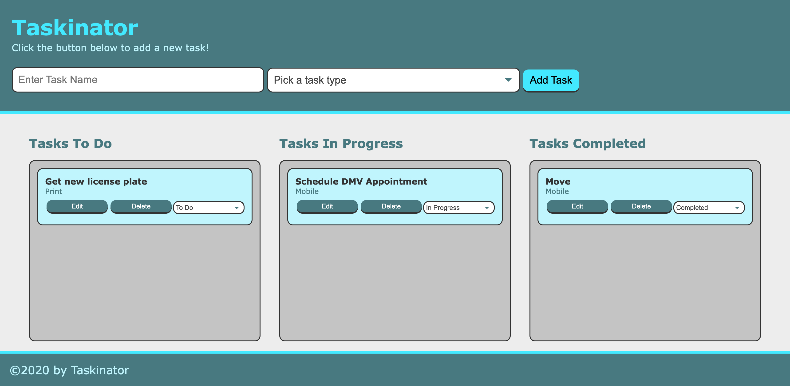

# taskinator-seahorse
Module 4 of our bootcamp, we were tasked with creating a task logging application online.

## What's the point of this?
The point of an application like this is that you can keep track of your tasks (like a to do list) virtually instead of on a physical piece of paper. There are different columns that you can move your tasks to based on their status (similar to a Kanban board). Users have the ability to enter the task title, select a category, and save tasks. By using local storage, they will be able to open the application on a fresh webpage and their tasks should still be on the page.

## What did I learn?
- How to access the DOM using methods like addEventListener(), querySelector(), createElement(), setAttribute(), and getAttribute()
- How to add interactivity with HTML by adding browser event listeners such as click, submit and change
- Even handling in Javascript using callback functions
- Using the event object
- Using the DOM to both read content from the HTML page and create new content to add to or edit on the page
- Identify DOM elements using HTML5 data attributes so we can interact with them
- Store task items in an organized list using an array of objects
- Sync the data using localStorave, and serialize/de-serialize the data using JSON.stringify() and JSON.parse()
- Track technical debt and refactor the code as needed
- Deploy the app to the internet using GitHub pages

## What does it look like?

## Where can I find it?
https://mmlawton15.github.io/taskinator-seahorse/